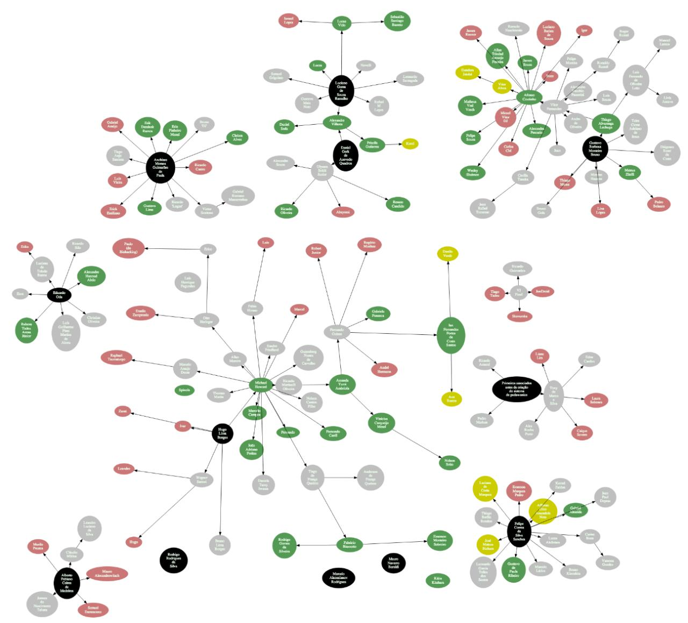

# Como usar:

    sudo apt-get install graphviz virtualenv
    virtualenv venv3 -ppython3
    . venv3/bin/activate
    pip install -r requirements.txt
    python garoa-associados.py

# Significado das cores no diagrama:

1. **Verde:** Associados atuais
2. **Preto:** Co-fundadores
3. **Amarelo:** Padawans apresentados nos últimos 6 meses
4. **Vermelho:** Parawans abandonados (muito antigos, com pouquissima chance de se efetivarem)
5. **Cinza:** Ex-associados.

# Exemplo de diagrama

Diagrama de exemplo gerado em 2019-FEV-13.

Para maior resolução e dados atualizados, exporte um PDF a partir do script python.

