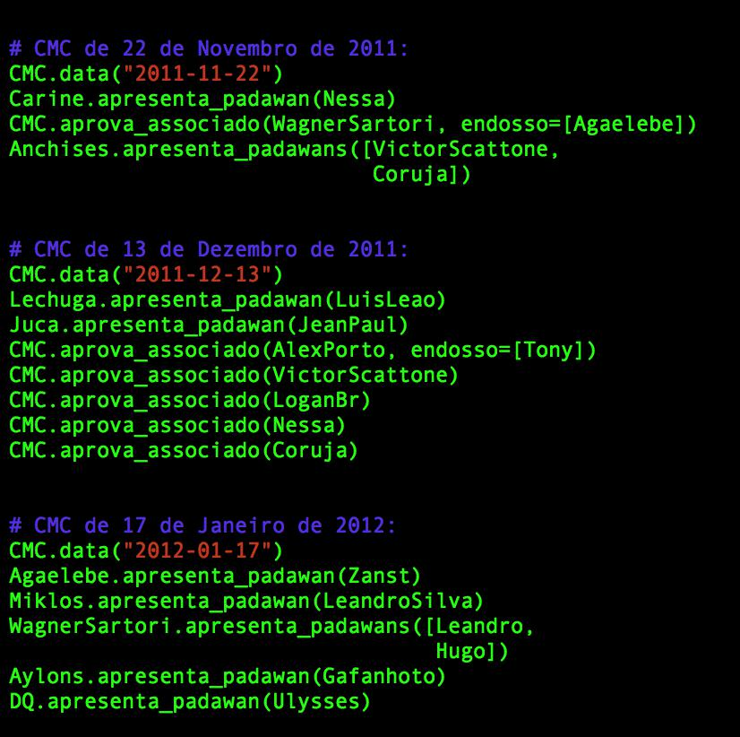
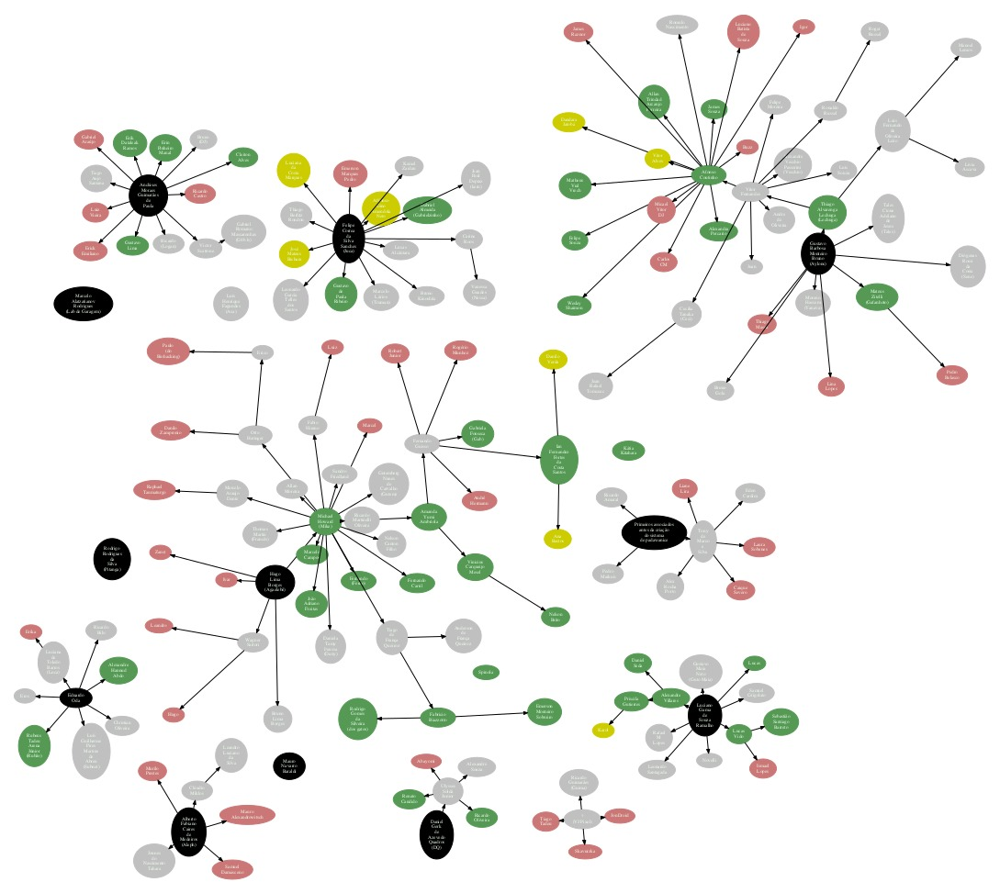

# O que é isso?

Esta é uma sistematização das informações sobre o quadro societário do Garoa Hacker Clube.

Ao longo dos anos, a evolução do quadro societário (por meio de admissões de novos associados, desligamentos e apresentações de "padawans") foi registrada nas atas das reuniões do Conselho Manda Chuva, nossos encontros mensais de gestão do clube. Entretanto, a precisão desses registros variou bastante e várias informações permaneceram ambíguas ao ponto de ser bastante difícil responder a perguntas como:

* "Quem somos?"
* "Quantos somos?"
* "Quem são os padawans aguardando aprovação?"
* "Estamos crescendo?" ou "Estamos encolhendo?"
* etc...

Uma outra fonte semi-estruturada de informação é uma planilha de associados organizada pelo tesoureiro, porém mantida privada por conter dados confidenciais como endereço residencial, telefone e email dos associados. As informações de data de admissão e data de desligamento dessa planilha ajudaram a complementar este grafo onde as atas de CMCs estavam imprecisas.

Foi criada uma API em python para documentar os eventos de alteração do quadro societário como visto no exemplo abaixo.

Ao executar este programa, é gerado um grafo de relacionamentos representando algo similar a uma "árvore genealógica" dos padawans, associados e ex-associados do Garoa. Um exemplo pode ser visto nas seções abaixo.

# Como usar:

    sudo apt-get install graphviz virtualenv
    virtualenv venv3 -ppython3
    . venv3/bin/activate
    pip install -r requirements.txt
    python garoa-associados.py

# Significado das cores no diagrama:

1. **Verde:** Associados atuais
2. **Preto:** Co-fundadores
3. **Amarelo:** Padawans apresentados nos últimos 6 meses
4. **Vermelho:** Parawans abandonados (muito antigos, com pouquissima chance de se efetivarem)
5. **Cinza:** Ex-associados.

# Exemplo de diagrama

Diagrama de exemplo gerado em 2019-FEV-15.

Para maior resolução e dados atualizados, exporte um PDF a partir do script python.

